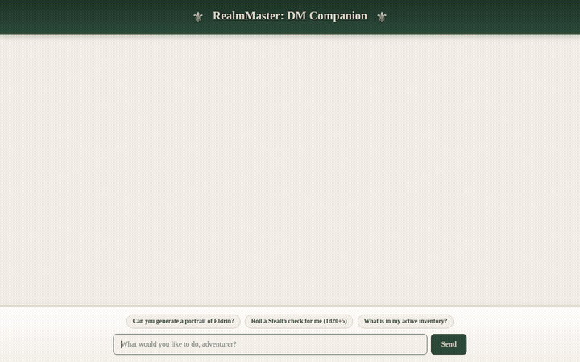

# RealmMaster 🎲⚔️

> **A conversational AI companion that helps tabletop RPG players and solo adventurers build characters, run encounters, and track campaigns with a catalog of spells, monsters, and items.**



---

## 🌟 Overview

**RealmMaster** is an omniscient tabletop RPG companion, rule keeper, visual artificer, and campaign manager built with Google's **Agent Development Kit (ADK)** and deployed to **Google Cloud Vertex AI Agent Runtime**. 

Whether you are a Dungeon Master balancing combat encounters on the fly or a solo player exploring dungeon depths, RealmMaster tracks your character profiles, queries official 5e rules, generates scene artwork and item showcase videos, and dynamically drops balanced loot.

---

## 🚀 Key Features & Google Cloud Tools

RealmMaster leverages the full suite of **Google Cloud & Vertex AI** developer capabilities:

- **🧠 Vertex AI Memory Bank (Long-Term Memory)**:
  Maintains cross-session long-term memory to persist character profiles (class, race, stats, HP), active inventories, party members, and ongoing campaign quest notes across conversations.
- **🗄️ Google Cloud Firestore (RPG Item & Spell Catalog)**:
  Serves as the structured database for magic items, weapons, armor, and scrolls. Supports real-time filtering, rarity tier lookups, and dynamic loot drop queries.
- **☁️ Google Cloud Storage (Asset Hosting)**:
  Automatically hosts generated visual art, character portraits, and item videos in a public bucket (`realm-master-assets-*`), returning persistent, embeddable HTTPS URLs.
- **📚 Vertex AI RAG Engine (Grounding on D&D 5e Rules)**:
  Vector retrieval corpus indexing the official 5e *Dungeon Master's Guide* (DMG). Provides grounded answers on environmental hazards, madness, downtime activities, and magic item mechanics.
- **🎨 Image Generation (Vertex AI Imagen / Gemini Image)**:
  Generates high-detail fantasy illustrations of characters, magical relics, and battle scenes on demand.
- **🎬 Omni Video Generation (`gemini-omni-flash-preview`)**:
  Synthesizes 720p cinematic showcase videos of rare artifacts and enchanted items in the `global` region, saving artifacts to the ADK session and streaming directly to Cloud Storage.
- **🃏 A2UI (Agent-to-User Interface)**:
  Emits rich, structured UI components (cards, columns, headers, status badges, and embedded media) that render natively in both the ADK Playground and the custom frontend.
- **🛡️ Agent Sandbox Code Execution**:
  Executes Python in a secure Vertex AI Agent Engine sandbox for mathematical XP scaling, Challenge Rating (CR) encounter math, and complex dice simulations.

---

## 🛠️ Integrated Agent Tools

| Tool | Purpose | Technology |
| --- | --- | --- |
| `preload_memory` | Loads character sheets, party state, and quest logs | Vertex AI Memory Bank |
| `roll_dice` | Parses standard dice notation (`1d20+5`, `2d6+3`, etc.) | Custom Python Tool |
| `lookup_5e_srd` | Fetches live monster stat blocks, spells, and equipment | D&D 5e SRD REST API |
| `consult_dungeon_masters_guide` | Semantic search across the DMG rulebook | Vertex AI RAG Engine |
| `generate_scene_art` | Creates illustrations of scenes, monsters, and characters | Vertex AI Imagen |
| `generate_item_video` | Produces short showcase videos of magical relics | Google Omni (`gemini-omni-flash-preview`) |
| `generate_encounter_loot` | Rolls balanced currency and magic items for defeated foes | Cloud Firestore & Dice Formulas |
| `search_item_catalog` / `get_item_details` | Queries the RPG compendium | Cloud Firestore |
| `sandbox_code_executor` | Runs code for complex encounter balance calculations | Agent Engine Code Sandbox |

---

## 🏰 Custom Fantasy Chat Frontend

The project ships with a custom **FastAPI proxy** and an immersive fantasy-themed chat UI:
- **"Lord of the Rings" Fantasy Theme**: Elven forest green palette, gold accents, parchment texture dialogs, and ornate fantasy flourishes.
- **Interactive Markdown & Media**: Markdown support via `marked.js`, 3D animated CSS dice rolls on result generation, and full-screen click-to-expand image modals.
- **Quick Prompts**: Contextual one-click prompt buttons to check quest status, roll dice, and generate loot.

---

## 💻 Running Locally

### 1. Run the ADK Agent
```bash
uv run adk web --port 8081
```

### 2. Run the Custom Frontend Proxy
```bash
cd frontend
python -m venv .venv-frontend
source .venv-frontend/bin/activate
pip install -r requirements.txt

export AGENT_ENGINE_RESOURCE_NAME="projects/<PROJECT_NUMBER>/locations/us-central1/reasoningEngines/<ENGINE_ID>"
export AGENT_DIRECTORY="app"
export PORT=8080

python main.py
```
Open **`http://localhost:8080`** in your browser.
